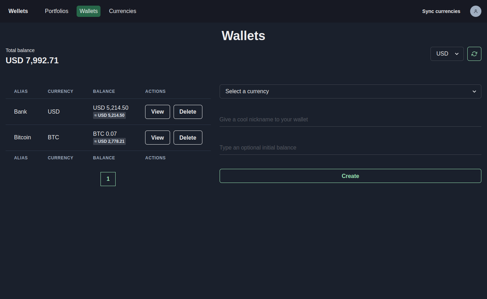
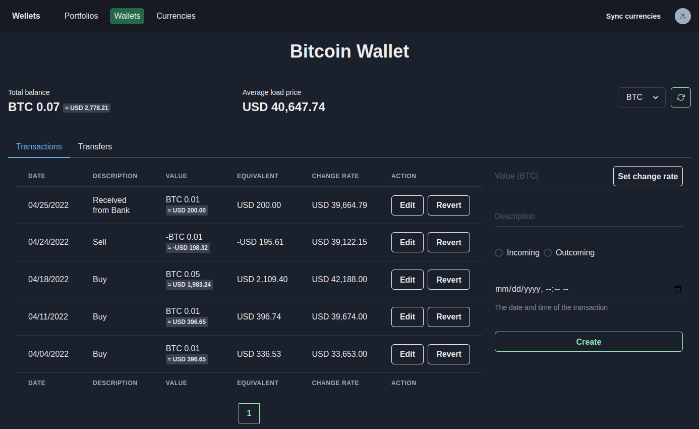
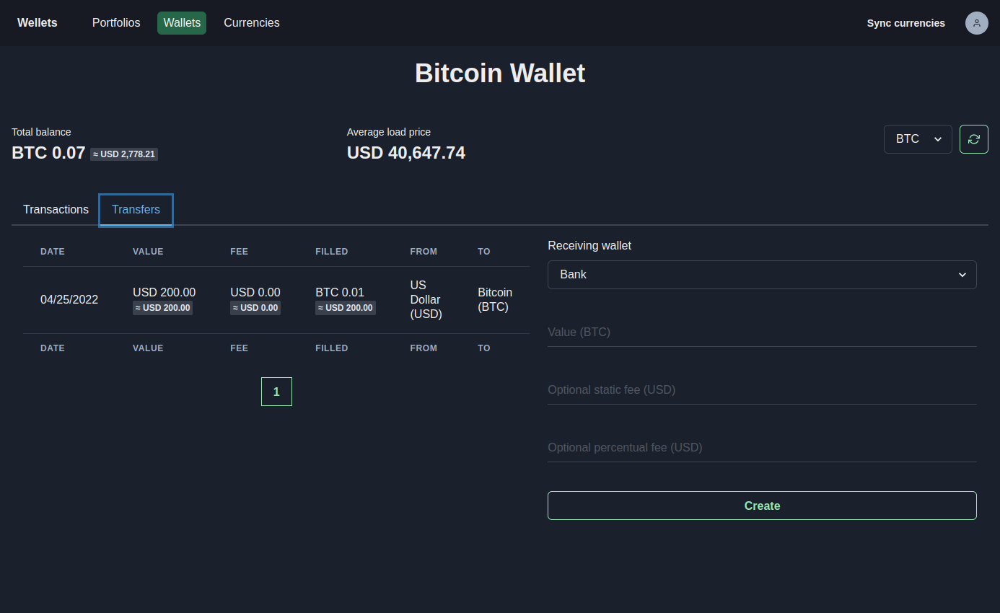
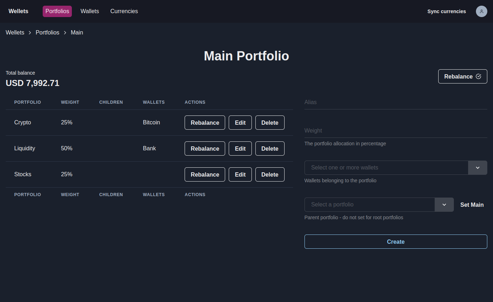
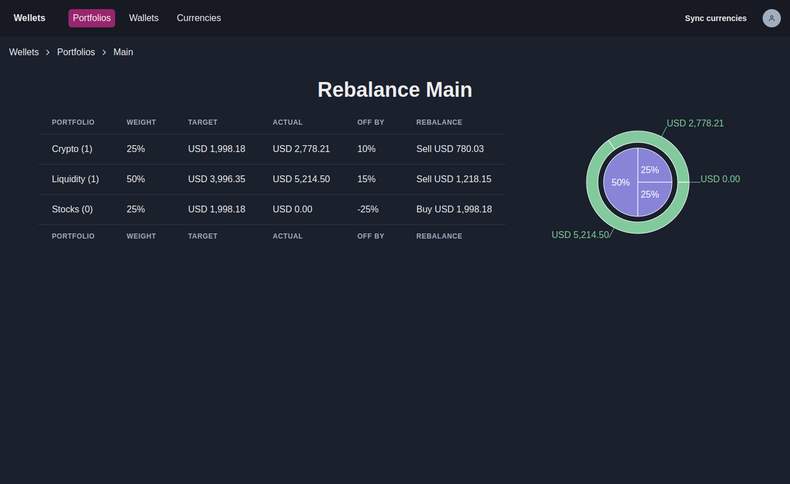
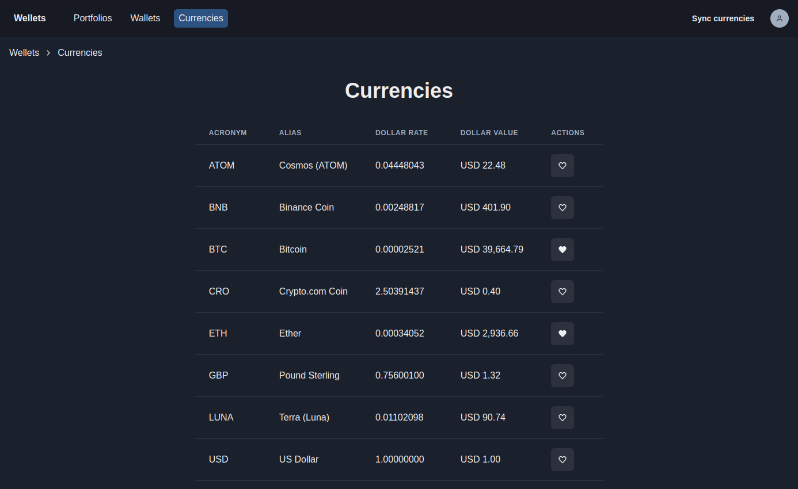

<div align="center">
  <a href="https://wellets.ondaniel.com.br/">
    <div>
      <h1 style="color: #68d391">Wellets</h1>
    </div>
    
  </a>
  <br>
  <br>
  <div>
    <a href="https://github.com/lparolari/wellets-frontend/tags/">
      
    </a>
    <a href="https://github.com/lparolari/wellets-frontend/blob/master/LICENSE">
      
    </a>
  </div>
  <hr>
</div>

## Table of Contents

  * [Introduction](#introduction)
  * [Demo](#demo)
  * [Screenshots](#screenshots)
  * [Features](#features)
  * [Core concepts](#core-concepts)
  * [Usage](#usage)
  * [Development](#development)
    * [Install](#install)
    * [Run](#run)
    * [Build](#build)
  * [Contribute](#contribute)
  * [Related works](#related-works)
  * [FAQ](#faq)
    * [Why is Wellets a fork?](#why-is-wellets-a-fork)
    * [Why there is no integration with back accounts or blockchain wallets?](#why-there-is-no-integration-with-back-accounts-or-blockchain-wallets)
  * [Author](#author)
  * [Credits](#credits)
  * [License](#license)

## Introduction

<!-- Keep track, monitor and manage your crypto with
[Wellets](https://wellets-frontend-pi.vercel.app/).  -->

*Wellets* is a crypto-oriented financial management tool that allows you to keep
under control your money. 

> Please note that Wellets does not have (for now) any type of integration with
> blockchain wallets, all management is done manually.

## Demo

Try it out at [https://wellets-frontend-pi.vercel.app/](https://wellets-frontend-pi.vercel.app/) 🚀

## Screenshots













## Features

* **Track incoming/outcoming transactions**. You can register incoming and
  outcoming transactions to a wallet. This allows you to keep control of your
  funds.

* **Track transfers between wallets**. You can manage transfers between your
  wallets in order to completely control your funds.

* **Show wallet history**. Given a wallet, you can view the wallet's balance
  history with different granularity: 1 hour, 1 day, 1 week, 1 month, 1 year.

* **Show wallet total balance**. Given a wallet, you can view its the total
  balance and countervalue in a desired currency.

* **Show wallet average load price**. Given a wallet, you can view the average
  load price against the wallet's currency.

* **Manage logical aggregation of wallets: portfolios**. A portfolio is a set of
  wallets with few extra properties: it may have one parent; zero, one, or more
  children; and a weight. The weight of a portfolio represents its impact among
  its siblings. 

* **See total balance of a portfolio**. Given a portfolio, you can view its the
  total balance and countervalue in a desired currency.

* **Rebalance portfolios**. Rebalancing is the process of realigning the
  weightings of a portfolio of assets (See [Rebalancing -
  Investopedia](https://www.investopedia.com/terms/r/rebalancing.asp)). Given a
  portfolio, Wellets is able to rebalance its children in order to maintain an
  original or desired level of asset allocation or risk.

* **Show up-to-date countervalues in your preferred currency**. You can set your
  preferred currency and the system will automatically dispay countervalues in
  the given currency.

If you want to send me a pull request or share some ideas please see Sec.
[Contribute](#contribute).

## Core concepts

### Wallet

**Def.** A wallet is a simple way to assign a name to the pair *(balance,
asset)*, with the semantic "I have *balance* of *asset*". (See [Asset](#asset)).
Each wallet has a list of transactions. (See [Transaction](#transaction)).

### Asset

**Def.** An asset is something valuable wrt a base currency. Some examples of
assets are: currencies (USD, EUR, ...), coins (Bitcoin, Ether, ...), tokens,
NFTs.

### Transaction

**Def.** A transaction represents a movement of funds wrt to a wallet. Each
transaction convoy two main information:

* value, i.e., the amount of assets moved: a number whose measure unit is the
  wallet's asset. Please note that positive value means an incoming transaction,
  while negative value an outcoming transaction;

* dollar rate, i.e., the ratio between one dollar and the exchange value of 1
  unit of wallet's asset at the time of creation 

Note: Transactions are the unique way to mutate the wallet's *balance*.\*

\*At time of writing, there is another edge case that allows to mutate the
balance directly: the wallet creation. However, we plan to remove this. ([#30 at
wellets-backend](https://github.com/lparolari/wellets-backend/issues/30)). 

### Portfolio

**Def.** A portfolio is a (eventually empty) collection of wallets. Each
portfolio may have one parent portfolio.

## Usage

```
docker-compose TBD
```

## Development

### Install

```bash
# Clone the repository
git clone git@github.com:lparolari/wellets-frontend.git
cd wellets-frontend

# Install project dependencies
yarn install
```

Also, you require to install
[wellets-backend](https://github.com/lparolari/wellets-backend). Please refere
to their [instructions](https://github.com/lparolari/wellets-backend#readme).

### Run

```bash
yarn start
```

Also, you require to run
[wellets-backend](https://github.com/lparolari/wellets-backend). Please refere
to their [instructions](https://github.com/lparolari/wellets-backend#readme).

### Build

```
yarn build
```

## Contribute

Any type of help is really appreciated. If you want to push me some changes, please

* fork the repository;
* develop your feature in a new branch:
* open a pull request;

otherwise, just leave an
[issue](https://github.com/lparolari/wellets-backend/issues) or [contact
me](https://t.me/lparolari).

## Related works

* [Wellets frontend](https://github.com/lparolari/wellets-frontend) (this repository)
* [Wellets backend](https://github.com/lparolari/wellets-backend)
* [Wellets docs](https://github.com/lparolari/wellets-docs) (work in progress)

## FAQ

### Why is Wellets a fork?

The original author does not actively mantain Wellets, so I decided to fork the project and to keep on the development.

### Why there is no integration with bacn accounts or blockchain wallets?

We simple decided to dedicate our effor in developing financial and money
management tools instead of integrations with different chains.

## Author

**Luca Parolari**

* Telegram: [@lparolari](https://t.me/lparolari)
* Github: [@lparolari](https://github.com/lparolari)
* Email: [luca.parolari23@gmail.com](mailto:luca.parolari23@gmail.com)

## Credits

* [Daniel Oliveira](https://github.com/ondanieldev), the original creator of
  this project.

## License

MIT © [Luca Parolari](https://github.com/lparolari)
